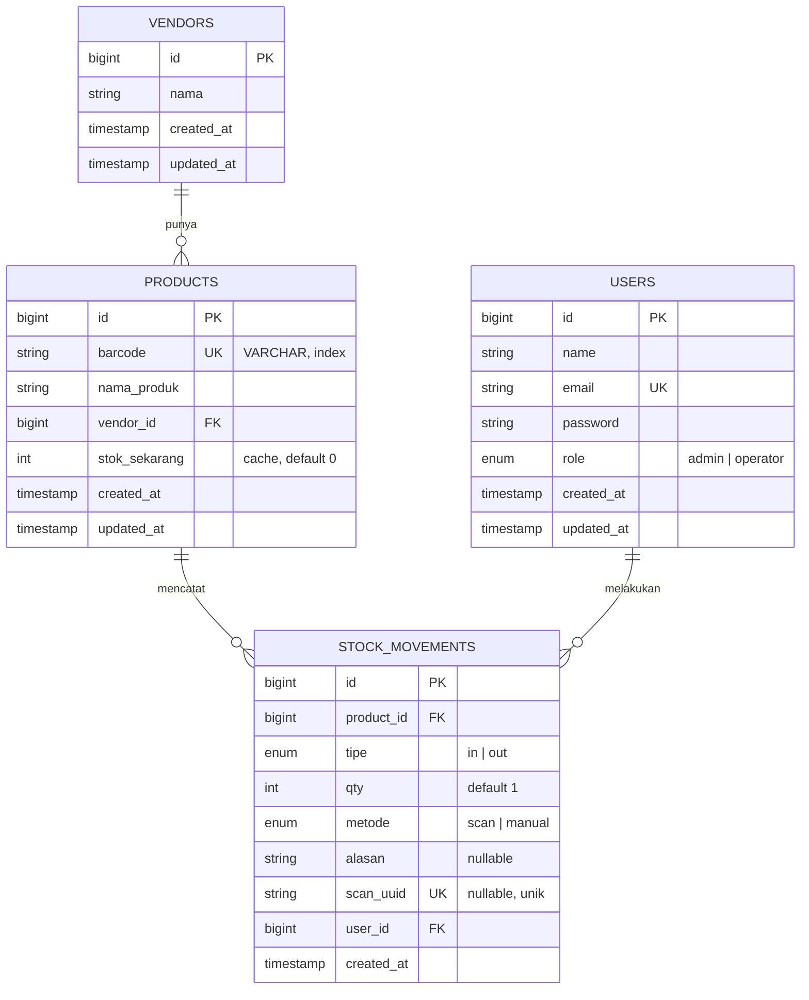

# 06 - Data Model & ERD

← [[00 - Index (MOC)]]

Tag: `#pokemonscanner/data`

## Prinsip

- **Stok = agregasi ledger.** Semua perubahan lewat `stock_movements` (append-only). `products.stok_sekarang` hanya cache.
- **`barcode` = VARCHAR, selalu.** Jangan integer — ada leading zero & campuran 12/13 digit. Lihat [[13 - Decision Log]] DEC-06.
- Stok awal 0; dibangun murni dari movement.
- **Validasi barcode saat scan: tanpa checksum.** Barcode diterima selama cocok string dengan `products.barcode` di master (exact match, tanpa normalisasi 12 vs 13 digit). Lihat [[13 - Decision Log]] DEC-12.

## ERD

## Detail Tabel

### `vendors`
| Kolom | Tipe | Catatan |
|---|---|---|
| id | bigint PK | |
| nama | string | dibuat via `firstOrCreate` saat import |
| timestamps | | |

### `products`
| Kolom | Tipe | Catatan |
|---|---|---|
| id | bigint PK | |
| barcode | **VARCHAR** | UNIQUE, ada index. Dukung 12 & 13 digit, leading zero |
| nama_produk | string | dibersihkan dari mojibake saat import |
| vendor_id | bigint FK → vendors | |
| stok_sekarang | int | cache, default 0 |
| timestamps | | |

### `stock_movements` (append-only ledger)
| Kolom | Tipe | Catatan |
|---|---|---|
| id | bigint PK | |
| product_id | bigint FK → products | |
| tipe | enum `in`/`out` | arah pergerakan |
| qty | int | default 1 (scan); bebas untuk manual |
| metode | enum `scan`/`manual` | |
| alasan | string nullable | wajib untuk manual keluar; opsional lainnya |
| scan_uuid | string UNIQUE nullable | idempotency; null untuk manual |
| user_id | bigint FK → users | pelaku |
| created_at | timestamp | tak ada updated_at (append-only) |

### `users`
Default Laravel + kolom `role` enum (`admin`/`operator`).

## Catatan Integritas

- `scan_uuid` UNIQUE menegakkan idempotency di level DB — sync ganda tidak menambah dua movement.
- Koreksi stok = movement baru (mis. `out` dengan alasan "koreksi opname"), bukan edit/hapus baris lama.
- Rekonsiliasi: `stok_sekarang` harus sama dengan `SUM(qty*sign(tipe))` per produk; sediakan job/perintah rekonsiliasi.

## Note Terkait

- [[04 - Functional Requirements]] (Modul MOVE)
- [[07 - Spesifikasi Import Excel]]
- [[08 - Spesifikasi Scan & Anti-Double-Input]]
- [[13 - Decision Log]]
