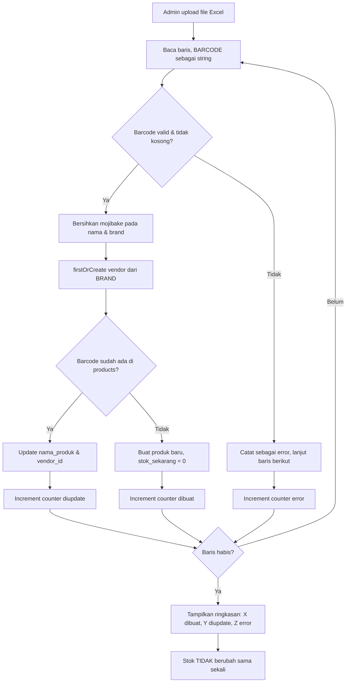

# 07 - Spesifikasi Import Excel

← [[00 - Index (MOC)]]

Tag: `#pokemonscanner/data`

## Tujuan

Admin mengimpor master produk dari file Excel, dapat dilakukan berulang, **tanpa pernah menyentuh stok**.

## Format Kolom Input

| Kolom | Wajib | Contoh | Catatan |
|---|---|---|---|
| `NO` | tidak | 1 | nomor urut, diabaikan untuk data |
| `BRAND` | ya | Pokémon | → vendor via `firstOrCreate` |
| `BARCODE` | ya | 0123456789012 | **dibaca sebagai string** |
| `PRODUCT NAME` | ya | Pikachu Plush | dibersihkan dari mojibake |

## Aturan Pemrosesan

### 1. Barcode sebagai string
`BARCODE` **wajib** dibaca & disimpan sebagai VARCHAR. Jangan biarkan library Excel mengonversi ke number (leading zero hilang, notasi ilmiah). Trim spasi. Lihat [[13 - Decision Log]] DEC-06.

### 2. Vendor otomatis (`firstOrCreate`)
`BRAND` → cari vendor by nama; belum ada → buat. Vendor bisa beda-beda antar baris.
> Data awal KidzStation: semua `BRAND` = "Kidz Station". Upload berikutnya akan berisi vendor asli.

### 3. Upsert produk by barcode
- Barcode **sudah ada** → update `nama_produk` & `vendor_id`.
- Barcode **belum ada** → buat produk baru, `stok_sekarang` = 0.

### 4. Cleaning encoding / mojibake
Perbaiki teks rusak sebelum simpan.
- Contoh nyata: `POKÃÂéMON` → `POKÉMON`.
- Normalisasi ke UTF-8; tangani double-encoding.

### 5. TIDAK menyentuh stok
Import **tidak pernah** menulis ke `stock_movements` maupun mengubah `stok_sekarang`. Upload ulang harus aman (idempotent terhadap stok). Lihat [[13 - Decision Log]] DEC-07.

### 6. Ringkasan hasil
Setelah import tampilkan: **X dibuat, Y diupdate, Z error**. Baris error tampil dengan alasan (mis. barcode kosong, nama kosong).

## Alur Import

## Kasus Uji (contoh)

- Import 109 baris KidzStation → 109 dibuat, 0 diupdate, 0 error; stok tetap 0.
- Import ulang file sama → 0 dibuat, 109 diupdate, 0 error; stok tak berubah.
- Baris mojibake → nama tersimpan `POKÉMON`.
- Baris barcode kosong → dihitung error, baris lain tetap diproses.

## Note Terkait

- [[06 - Data Model & ERD]]
- [[04 - Functional Requirements]] (Modul IMPORT)
- [[13 - Decision Log]]
