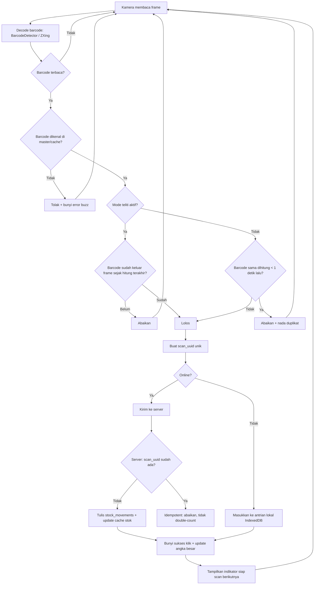

# 08 - Spesifikasi Scan & Anti-Double-Input

← [[00 - Index (MOC)]]

Tag: `#pokemonscanner/scan`

## Konsep

Scan = kamera HP membaca barcode terus-menerus. Tiap barcode dikenal → **+1** (mode masuk) atau **−1** (mode keluar) otomatis, dengan **umpan balik bunyi** supaya operator paham tanpa lihat layar. Tantangan utama: kamera membaca frame yang sama berulang kali → risiko double-count. Diselesaikan berlapis: **client cooldown + mode teliti + server idempotency**.

## Komponen UI Scan

- Viewfinder kamera belakang.
- Kotak bidik (aim box) di tengah.
- Tombol senter/torch (jika didukung).
- Angka hitungan **besar** (jumlah scan sesi / stok item terakhir).
- Toggle **"mode teliti"**.
- Indikator **"siap scan berikutnya"** untuk item identik.
- Indikator status sync (lihat [[09 - Spesifikasi Offline Sync]]).

## Decode

- Utama: `BarcodeDetector API` (Chrome Android).
- Fallback: **ZXing** bila API tak tersedia.

## Umpan Balik Bunyi (Web Audio API)

| Kejadian | Bunyi |
|---|---|
| Scan sukses (barcode dikenal, dihitung) | klik |
| Barcode tak dikenal | buzz / error |
| Duplikat diabaikan (dalam cooldown) | nada berbeda |

Bunyi **orisinal**, bukan SFX asli Pokémon (lihat [[11 - UI-UX & Tema Pokemon]]).

## Aturan Anti-Double-Input

1. **Cooldown per-barcode, default ±1 detik, dapat dikonfigurasi.** Barcode SAMA terbaca ulang dalam jendela ini → diabaikan (nada berbeda). Nilai cooldown adalah setting yang bisa diubah, bukan hardcode. Lihat [[13 - Decision Log]] DEC-13.
2. **Barcode BERBEDA → langsung dihitung**, tanpa menunggu cooldown barcode lain (scan campur tetap cepat).
3. **Indikator "siap scan berikutnya"** muncul saat cooldown item identik berakhir.
4. **Mode teliti (opsional, toggle):** barcode harus keluar frame dulu sebelum boleh dihitung lagi (bukan sekadar cooldown waktu). "Keluar frame" = **3 frame decode berturut-turut tanpa deteksi barcode yang sama**, nilai dapat dikonfigurasi. Lihat [[13 - Decision Log]] DEC-17.
5. **Lapis server (idempotency):** tiap scan bawa `scan_uuid` unik. Server tolak UUID kembar → aman terhadap replay & sync ganda.
6. **Barcode tak dikenal → DITOLAK + bunyi error.** Tidak membuat produk baru. Tambah produk lewat menu terpisah (lihat [[04 - Functional Requirements]] FR-PROD-02).

## Alur Scan + Anti-Double-Input

## Acceptance (ringkas)

Lihat [[04 - Functional Requirements]] FR-SCAN-01..04 dan FR-OFFLINE-*.

## Note Terkait

- [[09 - Spesifikasi Offline Sync]]
- [[06 - Data Model & ERD]] (`scan_uuid` UNIQUE)
- [[11 - UI-UX & Tema Pokemon]]
