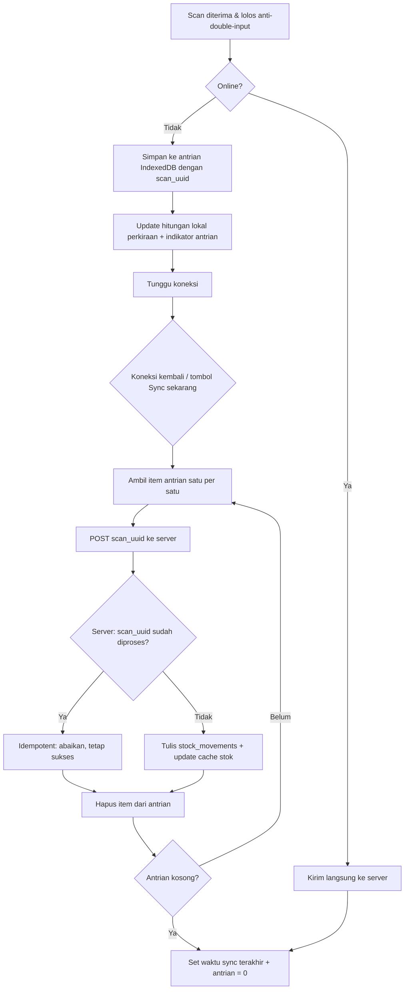

# 09 - Spesifikasi Offline Sync

← [[00 - Index (MOC)]]

Tag: `#pokemonscanner/offline`

## Tujuan

Sinyal gudang kadang jelek. Scan cepat masuk/keluar harus tetap jalan offline, lalu tersinkron otomatis saat online — **tanpa double-count**.

## Arsitektur

- **Service Worker** cache app shell (PWA).
- **IndexedDB** menyimpan:
  - **Cache master produk** → validasi barcode dikenal/tak dikenal tetap jalan offline.
  - **Antrian scan** → tiap item: `{scan_uuid, barcode, tipe, waktu, ...}`.
- **Auto-sync**: saat online kembali, antrian dikirim; server menegakkan idempotency via `scan_uuid` UNIQUE (lihat [[06 - Data Model & ERD]]).
- **Indikator status sync**: saat offline, tampilkan notifikasi jelas "Sedang offline, silakan cari sinyal untuk sync" + **jumlah task/item yang belum ter-sync**. Saat online, tampilkan waktu sync terakhir + tombol "Sync sekarang". Lihat [[13 - Decision Log]] DEC-16.

## Alur Offline Queue → Sync

## Accepted Constraints (SUDAH DISETUJUI)

Tulis eksplisit — ini batasan yang diterima, bukan bug:

1. **Angka stok saat offline bersifat perkiraan.** Nilai akurat setelah semua device sync. **Hasil akhir selalu benar** (eventual consistency).
2. **Produk baru hasil import belum dikenali HP yang sedang offline** sampai HP itu sync ulang (cache master diperbarui).
3. **Login pertama & input manual (dengan alasan, dari dashboard) tetap butuh online.** Yang bisa offline hanya **scan cepat masuk/keluar**.

## Batas & Catatan

- **Tidak ada batas retensi antrian** (waktu maupun jumlah item). Antrian dipertahankan selama app data tidak dihapus user. Lihat [[13 - Decision Log]] DEC-16.
- Konflik antar-device diselesaikan di server via ledger append-only + idempotency (bukan overwrite).
- Cache master perlu mekanisme refresh (mis. saat online / tombol sync) agar produk baru dikenali.

## Note Terkait

- [[08 - Spesifikasi Scan & Anti-Double-Input]]
- [[06 - Data Model & ERD]]
- [[12 - Asumsi, Batasan & Risiko]]
- [[13 - Decision Log]]
